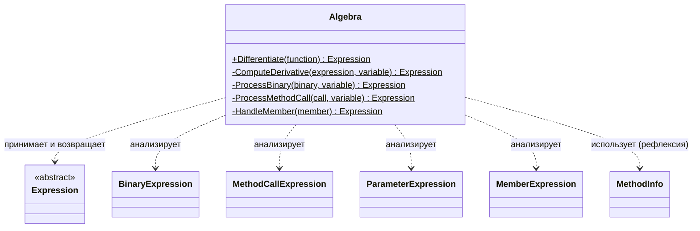

## Практика: Дифференцирование

### 1. Описание предметной области и сущностей

Данный код предназначен для символьного дифференцирования математических функций, заданных в виде лямбда-выражений. Алгоритм рекурсивно обходит дерево выражения и применяет правила дифференцирования к каждому узлу.

**Algebra** – статический класс, который принимает лямбда-выражение функции, извлекает из него переменную дифференцирования и запускает процесс рекурсивного обхода дерева выражения. Возвращает новое лямбда-выражение, представляющее производную.

**ComputeDerivative** – метод, выполняющий рекурсивный обход дерева выражения. В зависимости от типа узла (константа, переменная, бинарная операция, вызов метода и т.д.) применяет соответствующее правило дифференцирования.

**ProcessBinary** – метод, обрабатывающий бинарные операции. Поддерживает сложение (производная суммы равна сумме производных) и умножение (правило произведения: (f*g)' = f'*g + f*g').

**ProcessMethodCall** – метод, обрабатывающий вызовы математических функций. Поддерживает Sin (производная равна Cos(x)*x') и Cos (производная равна -Sin(x)*x'). При встрече с другими функциями выбрасывает исключение.

**HandleMember** – метод, обрабатывающий обращения к членам выражений. В случае неподдерживаемых конструкций выбрасывает исключение с информативным сообщением.

### 2. Диаграмма классов

