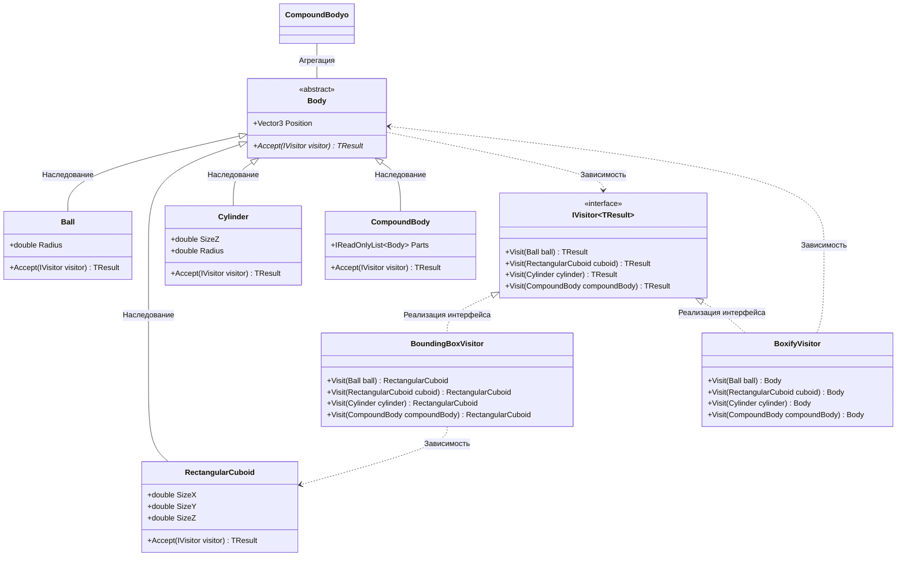

## **Практика: Геометрия-2**

### 1. Описание предметной области и сущностей

Система для работы с геометрическими телами. Реализован паттерн "Посетитель" для вычисления габаритных контейнеров и замены тел на параллелепипеды.

**IVisitor<TResult>** - интерфейс посетителя.

**Body** - абстрактный базовый класс всех тел. Содержит `Position` и метод `Accept()`.

**Ball** - шар. Содержит `Radius`.

**RectangularCuboid** - параллелепипед. Содержит `SizeX`, `SizeY`, `SizeZ`.

**Cylinder** - цилиндр. Содержит `Radius` и `SizeZ`.

**CompoundBody** - составное тело. Содержит список `Parts`.

**BoundingBoxVisitor** - посетитель для вычисления габаритного контейнера. Реализует `IVisitor<RectangularCuboid>`.

**BoxifyVisitor** - посетитель для замены всех тел на параллелепипеды. Реализует `IVisitor<Body>`.

### 2. Диаграмма классов

