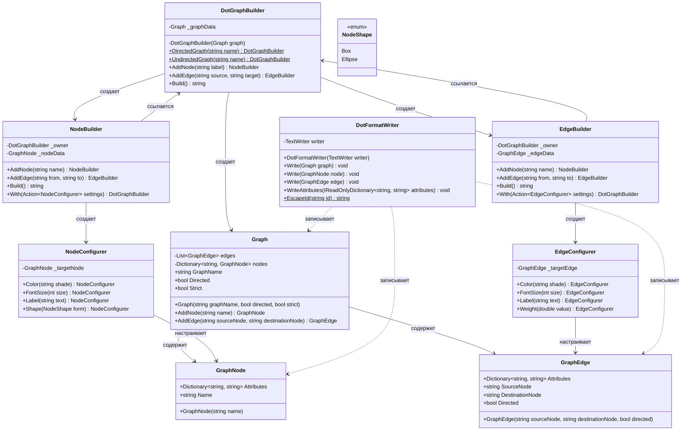

## **Практика: GraphViz**

### 1. Описание предметной области и сущностей

Система для построения графов в формате DOT с использованием Fluent API. Позволяет создавать ориентированные и неориентированные графы, добавлять вершины и рёбра с атрибутами

**Graph** - класс графа. Содержит:
- `GraphName` - имя графа
- `Directed` - является ли граф ориентированным
- `Strict` - строгий ли граф
- Методы: `AddNode()`, `AddEdge()`

**GraphNode** - класс вершины графа. Содержит:
- `Name` - имя вершины
- `Attributes` - словарь атрибутов вершины

**GraphEdge** - класс ребра графа. Содержит:
- `SourceNode` - исходная вершина
- `DestinationNode` - целевая вершина
- `Directed` - ориентированное ли ребро
- `Attributes` - словарь атрибутов ребра

**DotFormatWriter** - класс для записи графа в DOT-формат. Содержит методы:
- `Write(Graph graph)` - запись всего графа
- `Write(GraphNode node)` - запись вершины
- `Write(GraphEdge edge)` - запись ребра
- `WriteAttributes()` - запись атрибутов
- `EscapeId()` - экранирование идентификаторов

**DotGraphBuilder** - класс для построения графа с Fluent API. Содержит:
- `DirectedGraph()` - создание ориентированного графа
- `UndirectedGraph()` - создание неориентированного графа
- `AddNode()` - добавление вершины
- `AddEdge()` - добавление ребра
- `Build()` - построение DOT-строки

**NodeBuilder** - класс для настройки вершины. Содержит:
- `With()` - настройка атрибутов вершины
- Методы для добавления новых элементов

**EdgeBuilder** - класс для настройки ребра. Содержит:
- `With()` - настройка атрибутов ребра
- Методы для добавления новых элементов

**NodeConfigurer** - класс для настройки атрибутов вершины:
- `Color()` - цвет вершины
- `FontSize()` - размер шрифта
- `Label()` - метка вершины
- `Shape()` - форма вершины (Box, Ellipse)

**EdgeConfigurer** - класс для настройки атрибутов ребра:
- `Color()` - цвет ребра
- `FontSize()` - размер шрифта
- `Label()` - метка ребра
- `Weight()` - вес ребра

**NodeShape** - перечисление форм вершин: `Box`, `Ellipse`

### 2. Диаграмма классов

