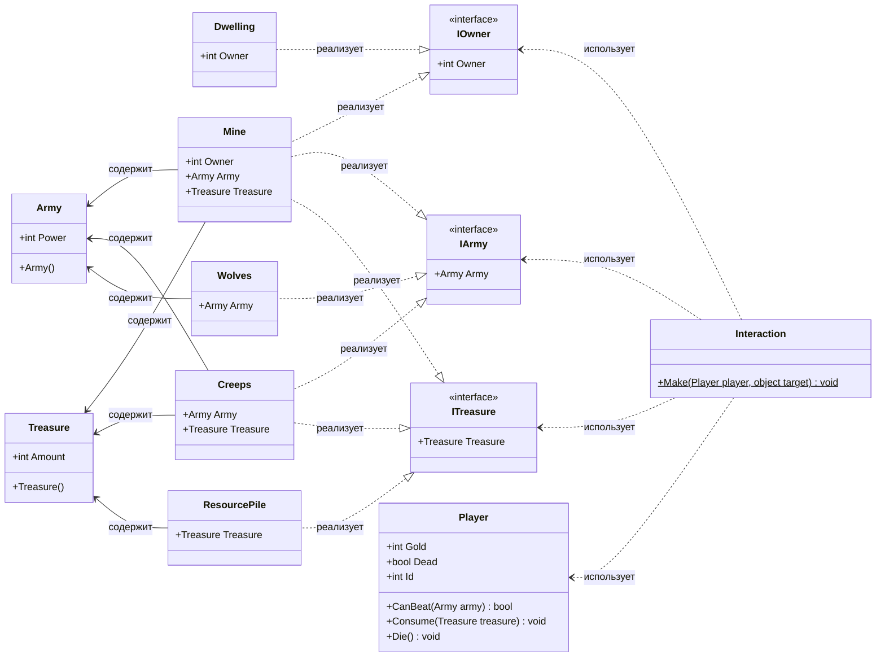

## **Практика: HoMM**

### 1. Описание предметной области и сущностей

В компьютерной игре персонаж игрока взаимодействует с различными объектами на карте. Игрок может сражаться с армией, собирать сокровища и присваивать объекты себе. Система построена на интерфейсах для гибкого расширения.

**IOwner** — интерфейс объектов, которые можно присвоить игроку. Содержит свойство `Owner` (идентификатор владельца).

**IArmy** — интерфейс объектов, имеющих армию. Содержит свойство `Army` (войска, с которыми можно сразиться).

**ITreasure** — интерфейс объектов, содержащих сокровища. Содержит свойство `Treasure` (ресурсы, которые можно собрать).

**Army** — класс, описывающий армию. Содержит числовое значение `Power` — силу армии.

**Treasure** — класс, описывающий сокровища. Содержит числовое значение `Amount` — количество ресурсов.

**Player** — класс игрока. Содержит:
- `Gold` — количество золота
- `Dead` — статус жизни (жив/мертв)
- `Id` — уникальный идентификатор игрока
- `CanBeat(Army army)` — проверяет, может ли игрок победить армию
- `Consume(Treasure treasure)` — собирает сокровища
- `Die()` — помечает игрока мертвым

**Dwelling** — класс жилища. Реализует `IOwner`. Может быть присвоено игроку.

**Mine** — класс шахты. Реализует `IOwner`, `IArmy`, `ITreasure`. Имеет охрану (`Army`), приносит ресурсы (`Treasure`) и может быть захвачена.

**Creeps** — класс нейтральных монстров. Реализует `IArmy`, `ITreasure`. Охраняют сокровища, с ними можно сразиться.

**Wolves** — класс волков. Реализует `IArmy`. С ними можно только сразиться (не охраняют ресурсы, нельзя захватить).

**ResourcePile** — класс кучи ресурсов. Реализует `ITreasure`. Можно собрать без боя.

**Interaction** — класс, управляющий взаимодействием игрока с объектами на карте. Содержит статический метод `Make(Player player, object target)`, который:
1. Проверяет наличие армии (`IArmy`) — если игрок не может победить, он умирает
2. Проверяет возможность присвоения (`IOwner`) — назначает владельца
3. Проверяет наличие сокровищ (`ITreasure`) — игрок собирает ресурсы

---

### 2. Диаграмма классов (Mermaid)

