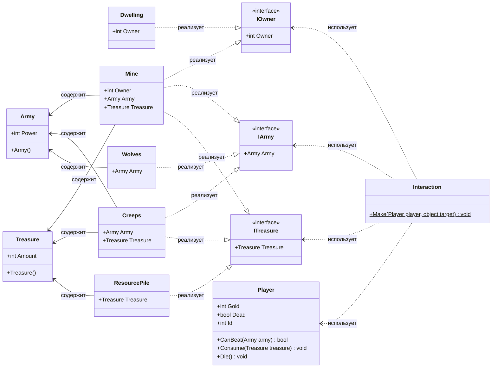

## **Практика: HoMM**

### 1. Описание предметной области и сущностей

Игрок взаимодействует с объектами на карте - сражается, собирает сокровища и присваивает объекты.

**IOwner** - интерфейс объектов, которые можно присвоить игроку. Содержит `Owner`.

**IArmy** - интерфейс объектов с армией. Содержит `Army`.

**ITreasure** - интерфейс объектов с сокровищами. Содержит `Treasure`.

**Army** - класс армии с силой `Power`.

**Treasure** - класс сокровищ с количеством `Amount`.

**Player** - класс игрока. Содержит `Gold`, `Dead`, `Id` и методы: `CanBeat()`, `Consume()`, `Die()`

**Dwelling** - жилище. Реализует `IOwner`.

**Mine** - шахта. Реализует `IOwner`, `IArmy`, `ITreasure`. Имеет охрану и ресурсы

**Creeps** - нейтральные монстры. Реализуют `IArmy`, `ITreasure`. Охраняют сокровища.

**Wolves** - волки. Реализуют `IArmy`. Только для боя

**ResourcePile** - куча ресурсов. Реализует `ITreasure`. Собирается без боя

**Interaction** - класс взаимодействия. Метод `Make()` проверяет `IArmy` (бой), `IOwner` (захват), `ITreasure` (сбор)

### 2. Диаграмма классов (Mermaid)

