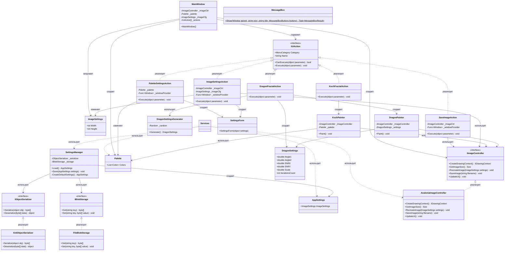

## **Практика: Fractal Painter**

### 1. Описание предметной области и сущностей

Система для рисования фракталов (Дракон, Кривая Коха) с возможностью настройки параметров изображения, палитры и сохранения результата. Реализована с использованием принципов Dependency Inversion и Dependency Injection.

**IUiAction** - интерфейс действия пользовательского интерфейса. Содержит:
- `Category` - категория меню
- `Name` - название действия
- `CanExecute()` - проверка доступности
- `Execute()` - выполнение действия

**IImageController** - интерфейс контроллера изображения. Содержит:
- `CreateDrawingContext()` - создание контекста рисования
- `GetImageSize()` - получение размера изображения
- `RecreateImage()` - пересоздание изображения
- `SaveImage()` - сохранение изображения
- `UpdateUi()` - обновление UI

**AvaloniaImageController** - реализация контроллера изображения для Avalonia UI.

**ImageSettings** - настройки изображения. Содержит `Width` и `Height`.

**Palette** - класс палитры цветов.

**SettingsManager** - класс управления настройками. Содержит:
- `Load()` - загрузка настроек
- `Save()` - сохранение настроек
- Использует `IObjectSerializer` и `IBlobStorage`

**IObjectSerializer** - интерфейс сериализатора объектов.
**XmlObjectSerializer** - реализация сериализатора в XML.

**IBlobStorage** - интерфейс хранилища данных.
**FileBlobStorage** - реализация хранилища в файловой системе.

**DragonPainter** - класс для рисования фрактала Дракона. Содержит:
- `Paint()` - рисование фрактала
- Использует `DragonSettings`

**KochPainter** - класс для рисования кривой Коха. Содержит:
- `Paint()` - рисование фрактала

**DragonSettings** - настройки фрактала Дракона:
- `Angle1`, `Angle2` - углы поворота
- `ShiftX`, `ShiftY` - смещение
- `Scale` - масштаб
- `IterationsCount` - количество итераций

**DragonSettingsGenerator** - генератор случайных настроек для Дракона.

**ImageSettingsAction** - действие настройки изображения. Реализует `IUiAction`.

**SaveImageAction** - действие сохранения изображения. Реализует `IUiAction`.

**PaletteSettingsAction** - действие настройки палитры. Реализует `IUiAction`.

**DragonFractalAction** - действие рисования Дракона. Реализует `IUiAction`.

**KochFractalAction** - действие рисования Коха. Реализует `IUiAction`.

**SettingsForm** - форма настроек (Avalonia Window).

**MessageBox** - диалоговое окно сообщений.

### 2. Диаграмма классов (Mermaid)

