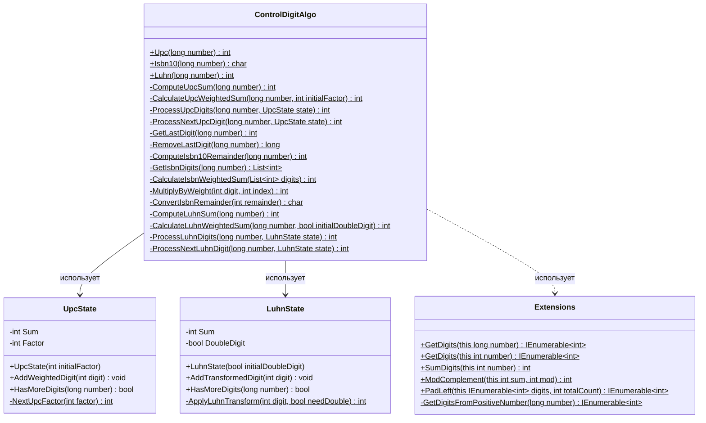

## **Практика: Контрольный разряд**

### 1. Описание предметной области и сущностей

Система для вычисления контрольных разрядов

**Extensions** - статический класс с методами-расширениями:
- `GetDigits()` - получение цифр числа справа налево
- `SumDigits()` - сумма цифр числа
- `ModComplement()` - дополнение по модулю
- `PadLeft()` - дополнение слева нулями

**ControlDigitAlgo** - статический класс с алгоритмами:
- `Upc()` - контрольный разряд UPC (множители 3 и 1)
- `Isbn10()` - контрольный разряд ISBN-10 (веса 10..2)
- `Luhn()` - контрольный разряд по алгоритму Луна

**UpcState** - вспомогательный класс для состояния при вычислении UPC:
- `Sum` - накопленная сумма
- `Factor` - текущий множитель (3 или 1)
- `AddWeightedDigit()` - добавление цифры с учётом множителя
- `HasMoreDigits()` - проверка наличия цифр

**LuhnState** - вспомогательный класс для состояния при вычислении Luhn:
- `Sum` - накопленная сумма
- `DoubleDigit` - флаг удвоения
- `AddTransformedDigit()` - добавление цифры с учётом удвоения
- `HasMoreDigits()` - проверка наличия цифр

---

### 2. Диаграмма классов (Mermaid)

