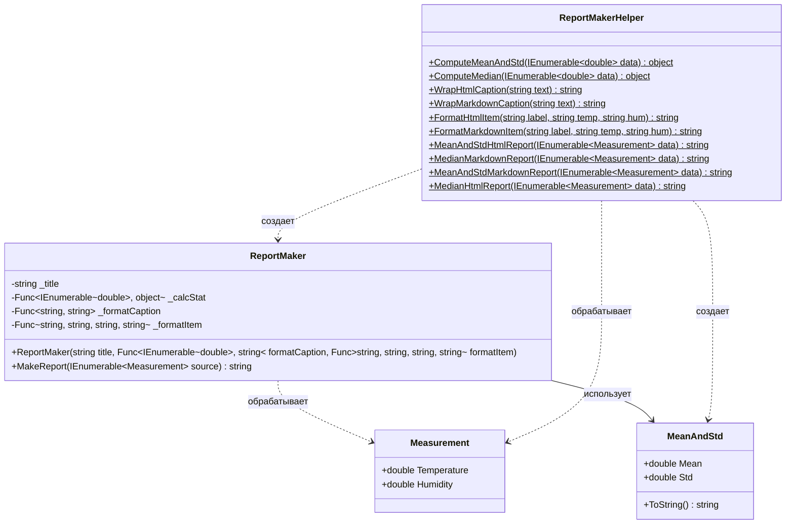

## **Практика: Генератор отчетов**

### 1. Описание предметной области и сущностей

Система для генерации отчетов по измерениям температуры и влажности. Используются делегаты для гибкой настройки форматирования и статистических вычислений.

**Measurement** - класс измерения. Содержит `Temperature` и `Humidity`.

**MeanAndStd** - класс результата статистики. Содержит `Mean` и `Std`.

**ReportMaker** - класс для генерации отчетов. Принимает в конструкторе делегаты для форматирования и вычислений

**ReportMakerHelper** - статический класс с методами для создания отчетов и вспомогательными функциями.

### 2. Диаграмма классов (Mermaid)

