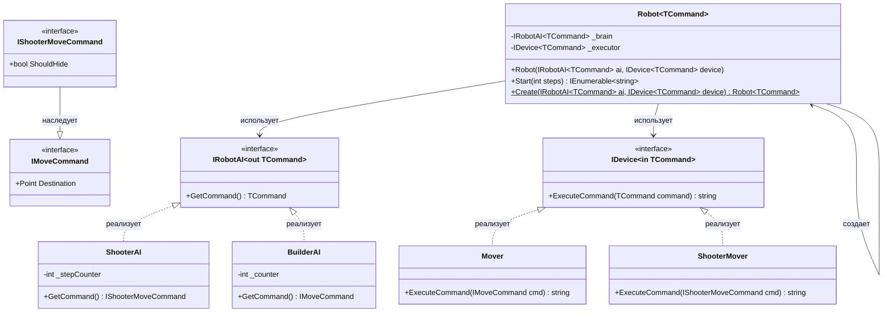

## **Практика: Роботы (Robots)**

### 1. Описание предметной области и сущностей

Система управления роботами. AI генерирует команды, Device их исполняет. Реализованы ковариантность и контравариантность.

**IMoveCommand** - интерфейс команды движения. Содержит `Destination`.

**IShooterMoveCommand** - интерфейс команды стрелка. Наследует `IMoveCommand`. Добавляет `ShouldHide`.

**IRobotAI<out TCommand>** - интерфейс AI с ковариантным параметром. Содержит `GetCommand()`.

**IDevice<in TCommand>** - интерфейс устройства с контравариантным параметром. Содержит `ExecuteCommand()`.

**ShooterAI** - AI стрелка. Реализует `IRobotAI<IShooterMoveCommand>`.

**BuilderAI** - AI строителя. Реализует `IRobotAI<IMoveCommand>`.

**Mover** - устройство движения. Реализует `IDevice<IMoveCommand>`.

**ShooterMover** - устройство стрелка. Реализует `IDevice<IShooterMoveCommand>`.

**Robot<TCommand>** - класс робота. Принимает AI и Device.

**Robot** - статический класс-фабрика для создания роботов.

### 2. Диаграмма классов (Mermaid)

