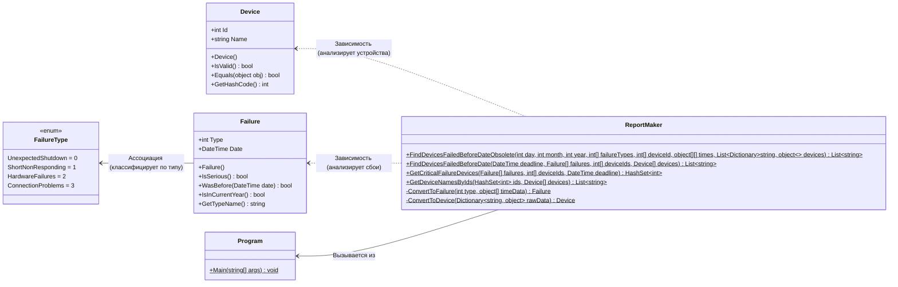

## **Практика: Сбои (Failures)**

### 1. Описание предметной области и сущностей

Программа предназначена для поиска устройств, в которых до определенной даты произошли критические сбои. Система анализирует историю сбоев и формирует список устройств, требующих внимания.

**FailureType** — перечисление типов сбоев:
- `UnexpectedShutdown` (0) — неожиданное отключение
- `ShortNonResponding` (1) — кратковременная неотзывчивость
- `HardwareFailures` (2) — аппаратные сбои
- `ConnectionProblems` (3) — проблемы с подключением

**Device** — класс, описывающий устройство. Содержит уникальный идентификатор `Id` и название `Name`.

**Failure** — класс, описывающий сбой. Содержит тип сбоя `Type`, дату возникновения `Date` и методы:
- `IsSerious()` — определяет, является ли сбой критическим (четный тип)
- `WasBefore(DateTime date)` — проверяет, был ли сбой до указанной даты
- `IsInCurrentYear()` — проверяет, произошел ли сбой в текущем году
- `GetTypeName()` — возвращает строковое название типа сбоя

**ReportMaker** — основной класс для формирования отчета. Содержит:
- `FindDevicesFailedBeforeDateObsolete()` — устаревший метод для обратной совместимости с тестами (конвертирует данные и вызывает новый метод)
- `FindDevicesFailedBeforeDate()` — новый метод, принимающий структурированные данные (`DateTime`, массивы `Failure`, `Device` и идентификаторы)
- `GetCriticalFailureDevices()` — получает идентификаторы устройств с критическими сбоями до указанной даты
- `GetDeviceNamesByIds()` — получает названия устройств по их идентификаторам
- `ConvertToFailure()` — преобразует сырые данные (тип сбоя и дату) в объект `Failure`
- `ConvertToDevice()` — преобразует сырые данные (словарь) в объект `Device`

**Program** — точка входа в приложение. Запускает выполнение тестов.

### 2. Диаграмма классов

