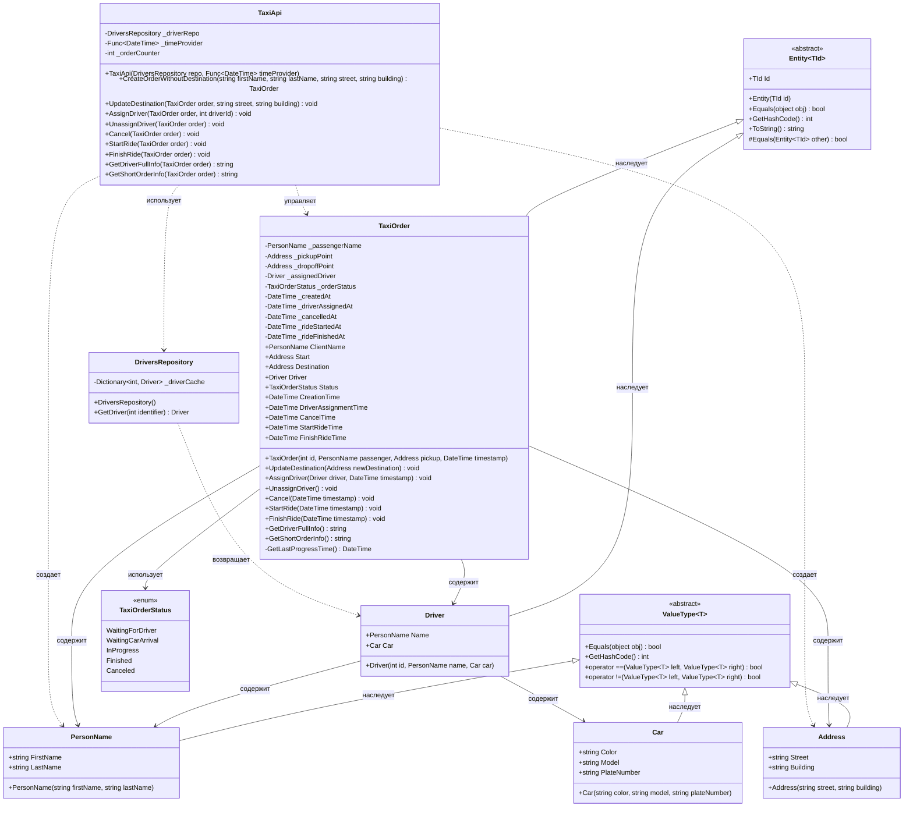

## **Практика: TaxiOrder**

### 1. Описание предметной области и сущностей

Система управления заказами такси. Заказ такси содержит информацию о клиенте, маршруте, водителе и статусе

**ValueType<T>** - базовый абстрактный класс для Value Objects. Обеспечивает сравнение по значению и правильный GetHashCode.

**Entity<TId>** - базовый класс для DDD сущностей. Содержит идентификатор `Id` и сравнение по идентификатору.

**PersonName** - Value Object. Содержит `FirstName` и `LastName`.

**Address** - Value Object. Содержит `Street` и `Building`.

**Car** - Value Object. Содержит `Color`, `Model`, `PlateNumber`.

**Driver** - Entity. Содержит `Id`, `Name` (PersonName), `Car` (Car).

**TaxiOrder** - корневая Entity (Aggregate Root). Содержит:
- `Id` (наследуется от Entity<int>)
- `ClientName` (PersonName)
- `Start` (Address)
- `Destination` (Address)
- `Driver` (Driver)
- `Status` (TaxiOrderStatus)
- `CreationTime`, `DriverAssignmentTime`, `CancelTime`, `StartRideTime`, `FinishRideTime`
- Методы: `UpdateDestination()`, `AssignDriver()`, `UnassignDriver()`, `Cancel()`, `StartRide()`, `FinishRide()`, `GetDriverFullInfo()`, `GetShortOrderInfo()`

**TaxiOrderStatus** - перечисление статусов заказа: `WaitingForDriver`, `WaitingCarArrival`, `InProgress`, `Finished`, `Canceled`.

**DriversRepository** - репозиторий для получения водителей. Содержит метод `GetDriver()`.

**TaxiApi** - сервис-фасад для внешнего API. Делегирует вызовы методам `TaxiOrder`.

### 2. Диаграмма классов

